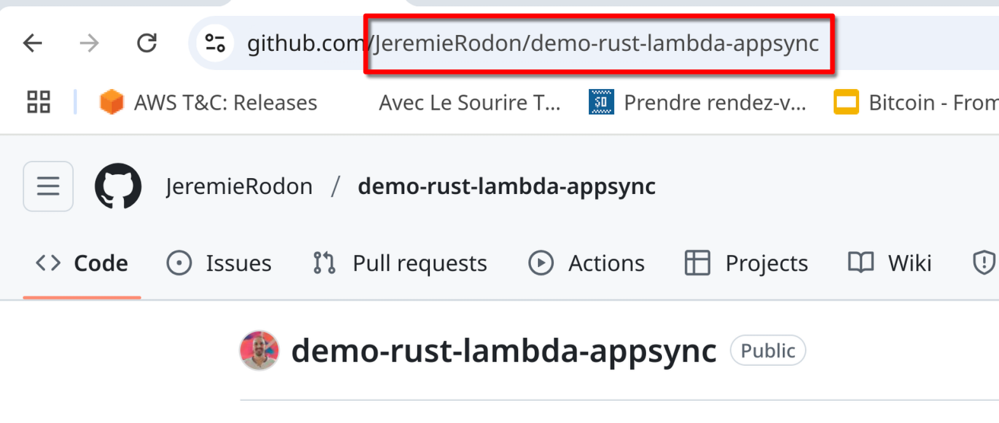
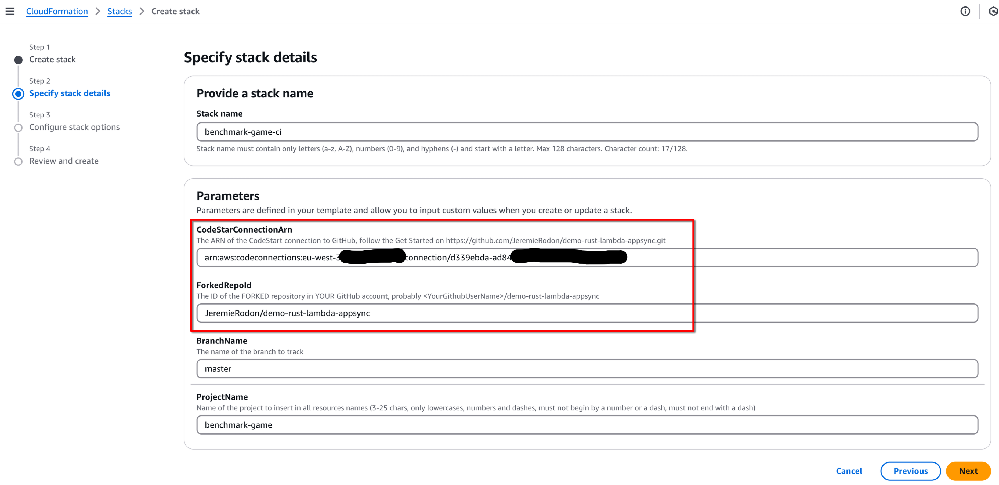

<!-- markdownlint-disable MD029 MD033 MD041 -->
<!-- PROJECT SHIELDS -->
[](https://github.com/JeremieRodon/demo-rust-lambda-appsync/blob/master/LICENSE)

<div align="center">
  <a href="https://github.com/JeremieRodon/demo-rust-lambda-appsync">
    
  </a>

  <h1>AppSync Resolver Benchmark Game</h1>
  <p>
    A real-time competitive game that benchmarks different AWS AppSync resolver implementations
    <br />
    <a href="#about-the-project"><strong>Learn More »</strong></a>
  </p>
</div>

This project demonstrates performance differences between AWS AppSync resolver implementations through an interactive clicking game. Players join teams powered by different backend technologies (Rust Lambda, Python Lambda, JavaScript resolver, or VTL resolver) and compete to determine the fastest implementation.

The project also serves as a production-ready reference architecture, showcasing:
- Complete AWS AppSync application deployment
- Infrastructure as Code (IaC) best practices
- Automated CI/CD pipeline setup
- Integration of the `lambda-appsync` crate for type-safe Rust Lambda development

👉 Check out the [`lambda-appsync`](https://github.com/JeremieRodon/lambda-appsync) repository for more details on the Rust integration.

<details>
  <summary>Table of Contents</summary>

- [About The Project](#about-the-project)
  - [Game Mechanics](#game-mechanics)
  - [AWS Architecture](#aws-architecture)
- [Getting Started](#getting-started)
  - [Prerequisites](#prerequisites)
  - [Deployment](#deployment)
  - [Cleanup](#cleanup)
- [Usage](#usage)
  - [Web Interface](#web-interface)
  - [Load Testing](#load-testing)
  - [Monitoring Results](#monitoring-results)
- [Development](#development)
  - [Requirements](#requirements)
  - [Local Testing](#local-testing)
- [License](#license)
- [Contact](#contact)

</details>

## About The Project

### Game Mechanics

The benchmark game follows a straightforward process:

1. Players register and are automatically assigned to one of four teams
2. When a game round begins, players click a button as rapidly as possible
3. The frontend precisely measures round-trip time for each click
4. Click counts and latency statistics are continuously reported to the backend
5. Victory is determined by the team achieving the lowest average latency
6. Individual victory goes to the player accumulating the most clicks

Each team utilizes a distinct AWS AppSync resolver implementation:

- **Team RUST**: Direct Lambda Resolver powered by a Rust Lambda function
- **Team PYTHON**: Direct Lambda Resolver utilizing a Python Lambda function
- **Team JS**: AppSync JavaScript resolver (AWS's recommended approach)
- **Team VTL**: AppSync Velocity Template Language (VTL) resolver

### AWS Architecture

<div align="center">
    
    <p><i>This PNG can be edited using <a href="https://draw.io">Draw.io</a></i></p>
</div>

Core Components:

- CloudFront distribution hosting the Vue.js static website
- AppSync GraphQL API implementing four distinct resolver techniques for comparison
- DynamoDB table managing player data and game state
- Cognito User Pool handling admin authentication
- API Key enabling player authentication

## Getting Started

### Prerequisites

1. An AWS account with permissions for:
   - AWS CodeStar Connections
   - AWS CloudFormation
   - AWS CodePipeline
   - Amazon S3
   - AWS CodeBuild
   - AWS Lambda
   - Amazon AppSync
   - Amazon DynamoDB
   - AWS IAM
   - Amazon Cognito
   - Amazon CloudFront

2. A GitHub account to fork the repository

### Deployment (quick)

1. Fork this repository to your GitHub account
2. Create a CodeStar connection to GitHub:
   - Go to CodePipeline console > Settings > Connections
   - Choose GitHub provider and follow the authorization process
   - Copy the connection ARN
3. Deploy the CI template:

   ```bash
   aws cloudformation create-stack \
     --stack-name benchmark-game-ci \
     --template-body file://ci-template.yml \
     --parameters \
       ParameterKey=ProjectName,ParameterValue=benchmark-game \
       ParameterKey=CodeStarConnectionArn,ParameterValue=YOUR_CONNECTION_ARN \
       ParameterKey=ForkedRepoId,ParameterValue=YOUR_GITHUB_USERNAME/demo-rust-lambda-appsync \
       --capabilities CAPABILITY_NAMED_IAM CAPABILITY_AUTO_EXPAND
   ```

4. Wait for the pipeline to complete (~30 minutes)

### Deployment (detailed)

#### 1. Fork the repo

Fork this repository in your own GitHub account. Copy the ID of the new repository (\<UserName>/demo-rust-lambda-appsync), you will need it later. Be mindful of the case.

The simplest technique is to copy it from the browser URL:



#### Important

In the following instructions, there is an *implicit* instruction to **always ensure your AWS Console
is set on the AWS Region you intend to use**. You can use any region you like, just stick to it.

#### 2. Create a CodeStar connection to your GitHub account

This step is only necessary if you don't already have a CodeStar Connection to your GitHub account. If you do, you can reuse it: just retrieve its ARN and keep it on hand.

1. Go to the CodePipeline console, select Settings > Connections, use the GitHub provider, choose any name you like, click Connect to GitHub


2. Assuming you were already logged-in on GitHub, it will ask you if you consent to let AWS do stuff in your GitHub account. Yes you do.


3. You will be brought back to the AWS Console. Choose the GitHub Apps that was created for you in the list (don't mind the actual number on the screenshot, yours will be different), then click Connect.


4. The connection is now created, copy its ARN somewhere, you will need it later.


### Deployment

Now you are ready to deploy, download the CloudFormation template [ci-template.yml](https://github.com/JeremieRodon/demo-rust-lambda-appsync/blob/master/ci-template.yml)
from the link or from your newly forked repository if you prefer.

5. Go to the CloudFormation console and create a new stack.


6. Ensure *Template is ready* is selected and *Upload a template file*, then specify the `ci-template.yml` template that you just downloaded.


7. Choose any Stack name you like, set your CodeStar Connection Arn (previously copied) in `CodeStarConnectionArn` and your forked repository ID in `ForkedRepoId`



8. Skip the *Configure stack options*, leaving everything unchanged

9. At the *Review and create* stage, acknowledge that CloudFormation will create roles and Submit.


At this point, everything will roll on its own, the full deployment should take ~30 minutes, largely due to the quite long first compilation of Rust lambdas and the very long deployment time of CloudFront.

If you wish to follow what is happening, keep the CloudFormation tab open in your browser and open another one on the CodePipeline console.

### Cleanup

⚠️ **IMPORTANT**: The stacks must be deleted in a specific order due to IAM role dependencies:

1. `root-stack-benchmark-game` - ⏳ Wait for status **DELETE_COMPLETE** - This stack uses an IAM role created by the CI stack
2. `benchmark-game-ci` - This stack owns the IAM role used by the first for its operations.

🚨 **PLEASE READ**: Do not attempt to delete both stacks simultaneously, as this **WILL** cause failures that are difficult to resolve. You must wait for the first stack to **COMPLETELY** finish deleting before starting deletion of the second stack. One of the IAM roles of the `benchmark-game-ci` stack is used for the operations of the `root-stack-benchmark-game` stack.

## Usage

### Web Interface

Once deployed:

1. Create an admin user in Cognito:
   - Go to the Cognito console
   - Select the user pool created by the stack
   - Create a new user with your email
   - Add the user to the "Admins" group
2. Access the game through the CloudFront URL provided in the stack outputs:
   - Register as a player to be assigned to a team
   - Access the admin interface by navigating to /admin in your browser
   - Use your admin account to start a game round
   - Click as fast as you can!
   - Watch the real-time leaderboard

### Load Testing

First compile the simulation tool:

```bash
cd utils/simulate_players
cargo build --release
```

The optimized binary will be available at `target/release/simulate_players`. You can copy it to any desired location.

Then use the simulation tool to generate synthetic load:

```bash
# Register 100 simulated players
./simulate_players \
  --api-endpoint "YOUR_APPSYNC_URL" \
  --api-key "YOUR_API_KEY" \
  --players 100 \
  --register-only

# Run simulation with 7 clicks/second for 20 seconds
# (Don't forget to start the game first if you don't want 700 errors/sec in your console... ask me how I know 😅)
./simulate_players \
  --api-endpoint "YOUR_APPSYNC_URL" \
  --api-key "YOUR_API_KEY" \
  --players 100 \
  --frequency 7 \
  --duration 20
```

### Monitoring Results

Monitor performance through multiple tools:

1. AppSync Console > Monitoring tab
   - Real-time resolver latency metrics
   - Error rates and types
   - Active connections count
   - Request counts by resolver

2. CloudWatch Metrics for AppSync resolvers
   - Navigate to CloudWatch > Metrics > AppSync
   - View resolver-specific metrics like:
     - Latency percentiles
     - Error counts
     - Throttled requests

3. CloudWatch Logs Insights for detailed execution analysis
   - Navigate to CloudWatch > Logs > Logs Insights
   - Select log groups under /aws/lambda/benchmark-game-*
   - Use AWS's example query for Lambda analysis

4. AWS X-Ray traces
   - Access via AppSync Console > Monitoring > Traces
   - Or navigate to X-Ray Console > Service map
   - View end-to-end request flow
   - Analyze resolver timing breakdowns
   - Identify bottlenecks in the request chain

## Development

### Requirements

- Rust 1.85+ with `cargo-lambda`
- Node.js 22+
- Python 3.12+
- Java 17+ JRE for DynamoDB Local
- DynamoDB Local ([download from AWS](https://docs.aws.amazon.com/amazondynamodb/latest/developerguide/DynamoDBLocal.DownloadingAndRunning.html)):

Install commands (Linux/MAC):

```bash
# Install Rust
curl --proto '=https' --tlsv1.2 -sSf https://sh.rustup.rs | sh
rustup default 1.85
# Install cargo-lambda to be able to run lambda locally
cargo install cargo-lambda

# Install Node.js dependencies (assuming you already have npm)
cd website
npm install

# Install Python dependencies (assuming you already have Python/Pip)
pip install boto3

# Download and extract DynamoDB Local
curl -O https://d1ni2b6xgvw0s0.cloudfront.net/dynamodb_local_latest.tar.gz
tar xzf dynamodb_local_latest.tar.gz
```

### Local Testing

1. Start local DynamoDB:

```bash
java -Djava.library.path=./DynamoDBLocal_lib -jar DynamoDBLocal.jar
```

2. Run Lambda functions locally:

```bash
cargo lambda watch
```

3. Invoke Lambda function locally:

```bash
cargo lambda invoke <function_name> --data-file event.json
```

4. Start frontend development server:

```bash
cd website
npm run dev
```

## License

Distributed under the MIT License. See `LICENSE.txt` for more information.

## Contact

Jérémie RODON - [](https://linkedin.com/in/JeremieRodon)

Project Link: [https://github.com/JeremieRodon/demo-rust-lambda-appsync](https://github.com/JeremieRodon/demo-rust-lambda-appsync)
